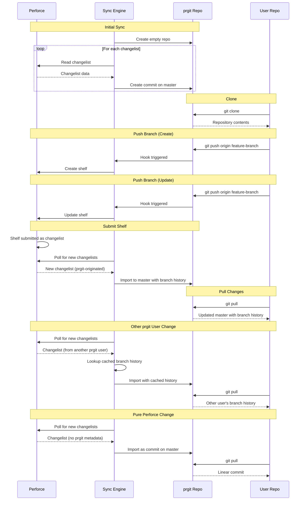

# Sync Engine Architecture

## Purpose

The sync engine is the core component responsible for bidirectional synchronization between Perforce and Git. It ensures that changes flow correctly in both directions while preserving Git history and maintaining Perforce as the source of truth.

## Synchronization Flows

## Perforce → Git Synchronization

### Initial Sync

Creates empty Git repository and iteratively processes each changelist from the Perforce client view in chronological order, converting each to a Git commit on master.

### Ongoing Sync

Polls Perforce for new changelists and imports them to the Git repository.

Three types of changelists are handled differently:

**Pure Perforce Changelist:** Imported as a single commit on master using Perforce changelist metadata.

**prgit-Originated Changelist:** Contains embedded metadata with branch commit history. The branch commits appear in the Git history on master while keeping Perforce content as truth.

**prgit-Originated from Another User:** Uses cached commit hashes from metadata to ensure all users see identical Git history for the same Perforce changelist.

## Git → Perforce Synchronization

Each Git branch (except master) maps to a Perforce shelved changelist. Git hooks trigger the sync engine on branch operations:

**Create/Update:** Pushing a branch creates or updates the corresponding shelf with the diff between master and branch tip. Branch commit metadata is embedded in the shelf description.

## History Preservation

When a prgit-originated changelist is submitted and synced back, the branch commits appear in the Git history while maintaining Perforce as the source of truth for content. This ensures users see realistic development flow in `git log --graph`.

### Multi-User Consistency

When multiple users work with the same Perforce client mapping, they need to see identical Git history. This is achieved by embedding exact Git commit hashes in the Perforce changelist metadata when a shelf is submitted. All users' sync engines read this metadata and recreate commits with identical hashes by preserving all commit properties (author, timestamps, message, tree).

